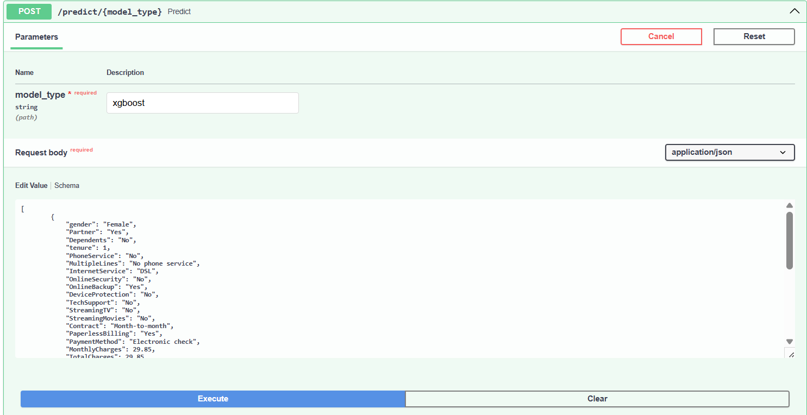
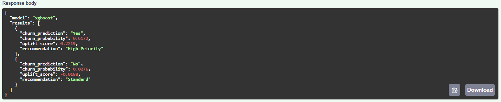
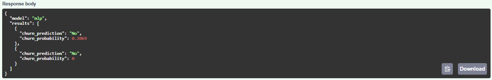
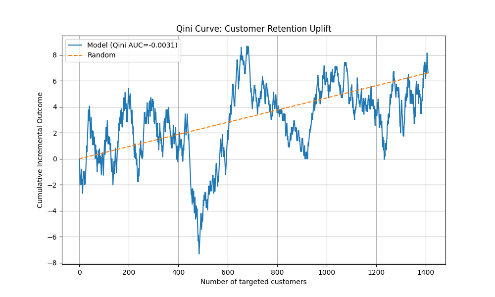

# Telco Churn Prediction Service and Uplift Modeling

This repository implements an **End-to-End Machine Learning Service** designed to predict customer churn and to optimize customer retention in the telecommunications setting. The goal is not just to train a churn prediction model, but also to build a deployable system that can identify at-risk customers and support targeted retention strategies through **uplift modeling**.

The core of this repository is a **FastAPI** service that serves a unified inference pipeline. This pipeline exposes two trained models for customer churn prediction: an **XGBoost** classifier and a **Multi-Layer Perceptron (MLP)**—paired with a custom T-Learner Uplift Model. All models are wrapped in **custom scikit-learn pipelines**, allowing them to accept raw input data and produce predictions in a consistent way. This ensures that the same preprocessing logic used during training is also applied at inference time, avoiding training-serving mismatches.

The project combines two complementary components:

- **Churn Prediction** using two supervised models (XGBoost and MLP) trained on historical customer data, including demographics, contract information, and usage behavior. The output is the probability that a customer will churn.

- **Uplift Modeling** on top of churn prediction to estimates the **incremental effect of retention interventions**. Instead of simply identifying high-risk customers, this approach helps identify persuadable customers — those who are likely to stay only if given an incentive. This allows marketing efforts to focus on customers where intervention has measurable impact.


## Key Features
- **Structured Pipeline Architecture**:
    - **ETL Pipeline**: A dedicated ETL workflow for ingesting and cleaning raw data, and creating reproducible raw/processed splits.
    - **End-to-End Inference Pipelines**: Separate, fully-encapsulated inference pipelines for both XGBoost and MLP models. These artifacts take raw data as input and output predictions.
    - **End-to-End Uplift Pipeline**: A fully encapsulated Two-Model uplift architecture built with XGBoost for both treatment and control groups. The pipeline internally splits data by treatment flag (created synthetically), trains separate XGBoost models, and outputs an uplift score defined as the difference between predicted treatment and control probabilities. All preprocessing, feature engineering, and model inference are handled within a single unified pipeline object.
    - **Leakage-Proof Data Flow**: Models are trained on raw splits. By handling all transformations internally within the pipeline, we ensure zero data leakage and total parity between training and inference.
- **Feature Engineering**: Leveraged a mix of built-in scikit-learn transformers and custom Python classes, designed to integrate cleanly with the sklearn API.
- **Production-Oriented Engineering**: 
    - Dockerized deployment using a lightweight Python 3.11 slim, optimized for CPU inference to achieve a lightweight image (< 1GB).
    - Carefully managed requirements.txt to ensure consistency between local development and production.
    - Centralized configuration through a **config.yaml** file for managing paths, hyperparameters, and feature definitions without modifying core code.

## Project Structure

```text
telco-churn-uplift/
├── data/
│   ├── raw/                
│   └── processed/          
├── models/                             # Inference artifacts (ignored by Git, mounted via Docker)
│   ├── preprocessor_pipeline.joblib    # Full ETL pipeline: engineering, transformations, scaling, & encoding
│   ├── xgboost_v1.joblib               # End-to-End Pipeline: Preprocessing + Trained XGBoost Classifier
│   ├── mlp_v1.joblib                   # End-to-End Pipeline: Preprocessing + Trained MLP Classifier
│   └── uplift_v1.joblib                   # End-to-End Pipeline: Preprocessing + Trained MLP Classifier
├── notebooks/              
├── src/                   
│   ├── etl/                
│   ├── features/           # Custom Sklearn Transformer classes
│   ├── models/             # Training scripts
│   ├── serve/              # FastAPI application and prediction service
│   └── utils/              # Logging and config loader functions
├── docs/images                  
├── config.yaml             # Global configuration (paths, parameters, hyperparameters, feature lists)
├── Dockerfile              # Optimized multi-layer build for CPU-only inference
├── .dockerignore           
├── .gitignore              
├── requirements.txt        
├── LICENSE                 
└── README.md 
```

## Usage (Local Setup)
To get the project up and running locally, follow these steps in order.

**1. Environment Setup** 
 
First, clone the repo and set up a virtual environment to keep your global Python installation clean:

```bash
git clone https://github.com/Khaghshenas/telco-churn-uplift.git
cd telco-churn-uplift
python3 -m venv venv  # python -m venv venv in Windows
source venv/bin/activate # venv\Scripts\Activate.ps1 in Windows (PowerShell)
pip install -r requirements.txt
```

**2. Data Preparation**

The raw dataset is not included in this repository. To run the pipeline:
- First Download the dataset from [Kaggle](https://www.kaggle.com/datasets/blastchar/telco-customer-churn) and place the ```WA_Fn-UseC_-Telco-Customer-Churn.csv``` file in ```data/raw/```.
- Then Run the ETL script to generate train/test splits in ```data/processed/```:
```bash
python -m src.etl.churn_etl
``` 

**3. Training & Inference**

Once your data is ready, you have a few ways to interact with the models:

- **Retrain models**: If you want to experiment with different architectures, hyperparameters or updated data, you can trigger the training pipelines for all models. These scripts will automatically save the new end-to-end ```.joblib``` artifacts to the ```models/``` directory. 
```bash
python -m src.models.train_xgboost
python -m src.models.train_mlp
python -m src.models.train_uplift
```
- **CLI Inference**: To test the pipeline without starting the web service, you can run the prediction script directly. This is the fastest way to verify that the custom transformers and paths are working correctly.
```bash
python -m src.serve.predict
```
- **Start the FastAPI Service**: For production-style testing, run the API. You can use ```--reload``` so that any changes you make to the source code are reflected immediately.
```bash
uvicorn src.serve.api:app --reload --port 8000
```
Once the service is running, open [http://127.0.0.1:8000/docs](http://127.0.0.1:8000/docs)
 in your browser. The Swagger UI lets you send test JSON payloads to the models and view churn probabilities and uplift score in real time:
 
 

 

  

**4. Docker Deployment**

This project can also be deployed inside a Docker container for reproducible inference.

- **Build the Docker Image**: From the project root directory, build the Docker image:
```bash
docker build -t telco-churn-uplift-api .
```

- **Run the Docker Container**:
```bash
docker run -p 8000:8000 telco-churn-uplift-api
```
This exposes the inference service on port 8000.

- **Stop the Container**:
```bash
docker ps
docker stop <container_id>
```

## Evaluation Results
## Churn Prediction

We evaluated both the XGBoost and MLP models using the held-out test set ($20\%$ of the raw data). Because telco churn is a classic imbalanced classification problem, we focused on metrics that penalize false negatives and false positives.

| Model     | Precision | Recall | F1-Score | ROC-AUC | Training Time (s) |
|-----------|-----------|--------|----------|---------|-------------------|
| XGBoost   | 0.6523    | 0.5267 | 0.5828   | 0.8407  | 0.37              |
| MLP       | 0.5091    | 0.5989 | 0.5504   | 0.7710  | 4.18              |

The results show a fairly typical pattern when comparing tree-based models and neural networks on tabular data.

- **XGBoost as the stronger overall model**

XGBoost performs better across most metrics, with a higher ROC-AUC (0.84) and F1-score (0.58). It’s also more precise, which means fewer false positives. In practical terms, this reduces the risk of offering incentives to customers who weren’t likely to churn in the first place — an important consideration when retention has real costs.

- **MLP prioritizes recall**

MLP achieves the highest recall (0.60), meaning it captures more of the actual churners. If the business prioritizes minimizing missed churn cases — for example, when customer lifetime value is high — this behavior can be desirable. The trade-off is lower precision and overall weaker discrimination compared to XGBoost.

- **Training efficiency**

There is also a noticeable gap in training time. XGBoost trained about 11× faster than the MLP. For this tabular dataset, tree-based methods not only perform better but also train significantly faster, making XGBoost the more practical choice for experimentation and iteration.

## Uplift Modeling

We evaluated the Two-Model uplift architecture (using XGBoost for both treatment and control groups) with Causal Inference metrics rather than standard accuracy. Since the goal is to estimate the Incremental Impact of a retention offer, we focus on the Qini Coefficient and Uplift at Top K.
- **Qini Coefficient** = overall uplift ranking quality (how much better than random our targeting strategy is).
- **Uplift@K** = incremental gain if we target only the top K% highest-uplift customers.

| Metric           | Result   | Interpretation                                                          |
|------------------|----------|-------------------------------------------------------------------------|
| Uplift @ Top 20% | +2.62%   | High-efficiency targeting; captures significant gains in the first 20%. |
| Qini AUC         | -0.0031  | Indicates the causal signal is highly concentrated in the top segments. |

*NOTE: In a group of 100,000 customers, a 2.62% uplift means 2,620 customers are retained who would have otherwise churned, directly impacting revenue.

The results show that while the model demonstrates a strong 2.62% incremental lift in the primary target customers, the overall metrics reflect the inherent challenges of extracting causal signals from a randomized synthetic treatment distribution.
 
 - **Targeting Efficiency** 
 
 The 2.62% Uplift at 20% demonstrates that even with simulated treatment, the model successfully identifies a "Persuadable" segment.

 - **Impact of Synthetic Randomization** 
 
 The near-zero Qini AUC is mainly the result of the Synthetic Random Treatment Assignment. In real-world observational data, treatments (e.g., discounts) are usually correlated with customer behavior (Selection Bias). By using a purely random synthetic assignment, we created a "Worst-Case Scenario" for the model. 

 

 As the Qini curve shows, the model achieves its maximum separation from the random baseline within the first two deciles, confirming that the predictive power is concentrated in the highest-ranked 'persuadable' customers before the synthetic noise leads to a convergence with the random targeting line.

## License

This project is licensed under the MIT License.

